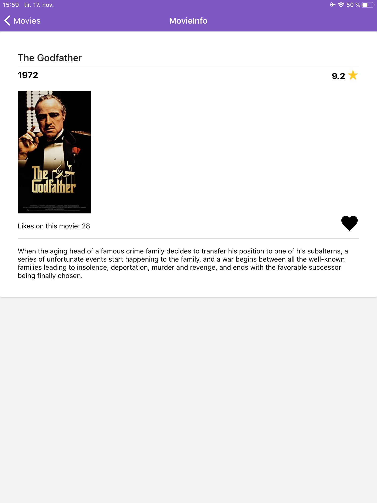

# Projekt 4
Vi valgte alternativ A, React Native, for prosjekt 4. Vi bestemte oss for å jobbe videre i samme gruppe som de tidligere prosjektene og endte da opp med
å bruke backend fra prosjekt 3. Backend kjører kontinuerlig fra virtuell maskin, slik at man kun trenger å kjøre frontend for å få opp appen.  

## Innhold
1. [Om](#om)
2. [Teknologi](#teknologi)
    1. [React-native og Expo](#React-native)
    2. [Redux](#REDUX)
    3. [Async Storage](#Async-storage)
    4. [Tredjepartsomponenter](#komponenter)
4. [Installering](#Installering)
5. [Testing](#Testing)
6. [Bruk av git](#git)
7. [Sources](#source)

# Om prosjektet <a name="om"></a>:
I dette prosjektet har vi laget en mobilapplikasjon for filmsøk, inspirert av prosjekt 3. Mobilapplikasjonen lar deg søke, filtrere, sortere, bla og like filmer. 
Når du kommer inn på hovedsiden kan du trykke deg inn på "Go to movies", der du kan finne nærmere 900 filmer. 
Trykker du på "Read more" under filmene vil du få opp ytterlige informasjon om filmene som blant annet tittel, utgivelsesår, IMDB-rating og et 
lite sammendrag av hver film. Her vil du også få muligheten til å se hvor mange som har likt filmen, samt gi din egen like/unlike ved å trykke på hjertet. Brukeren kan både søke, filtrere og sortere på hele filmsettet, og resultatet blir representert 
på ulike sider man kan bla seg gjennom. Vi har satt default sorteringen basert på rangering, siden vi tenker at dette er det mest naturlige valget slik at de best
rangerte filmene havner øverst. Både søk, filtrering og sortering fungerer om hverandre og man kan gjøre alle operasjonene samtidig dersom man ønsker et mer 
spesifisert søk. 


# Teknologi <a name="teknologi"></a>:


### React-native og Expo <a name="react-native"></a>:
Prosjektet er basert på React-native og Expo og har blitt initialisert med 

````
npm install --global expo-cli

expo init my-app
````

De funksjonelle komponentene og klassene er implementert ved hjelp av JSX og Typescript. Prosjektet er satt opp av ulike komponenter der alt blir satt sammen i App.tsx og routes.tsx. 
Route-filen står for navigasjon mellom de ulike sidene, der stack navigator er tatt i bruk. Derfra blir det lagd en stack som gir deg muligheten til å gå fra hjemmesiden, til filmbiblioteket, og videre til detaljer om de ulike filmene. Når du er inne på filmbibloteket kan du velge å sortere/filtrere ved å trykke på filterikonet. Da dukker det opp en modal over innholdet som gir deg mulighet til å sortere/filtrere. 

Vi har gjenbrukt mye kode fra prosjekt 3, men det er visse forskjeller vi har måttet gjøre for å få den til å fungere og kjøre i react native. Alt av styling i prosjekt 3 ble gjort i egne css filer, mens i prosjekt 4 har vi brukt stylesheets direkte inne i filene. En annen forskjell er at react native ikke bruker HTML for å rendre appen, men egne komponenter. F.eks så bruker de view der vi gjerne ville brukt div i react.js. 


### Async Storage <a name="Async-storage"></a>:
Fra tidligere prosjekt har vi hatt en “like” funksjon som vi ønsket å  implementere i dette prosjektet også. Når en bruker trykker på hjerte-ikonet blir filmen likt og databasen oppdateres. Den samme logikken gjelder hvis brukeren velger å unlike filmen igjen. Vi har benyttet oss av Async Storage for at likesene lagres lokalt  på enheten. Liksene til en bruker blir da bevart for hver gang brukeren er inne på appen. 


### Redux <a name="redux"></a>:
Vi har som i prosjekt 3, tatt i bruk Redux til filtrert søk. Men i dette prosjektet var det nødvendig med Redux når det kom til sortert søk også ettersom vi lagde en egen komponent som tok for seg sortering. Vi måtte dermed ha muligheten for å lagre valgt sorteringsform globalt slik at vi fikk hentet ut riktig verdi i backendkallet i movies.tsx filen. 
Verdiene for filtrering og sortering  blir lagret i store.tsx og ved hjelp av Reducer-funksjoner som ligger i updateGenreFilter.ts blir sorterings og filtreringsverdier oppdatert. Ved å ta i bruk Redux Devtools, som er en extention i Google Chrome, kan vi nå sjekke om sorteringsverdier og filtre som blir krysset av blir lagt i staten.


### Tredjepartskomponenter <a name="komponenter"></a>:
I dette prosjektet har vi tatt i bruk react-native-paper som tredjepartskomponent til blant annet de ulike "kortene" for å vise hver film. Grunnen til at vi valgte å bruke tredjepartskomponent på visningen av filmene var fordi vi synes dette så mest ryddig ut, og fikk muligheten til å teste tredjepartskomponenter for React native. Dette sparte oss også for mye tid, og vi kunne bruke tiden på å implementere funksjonalitet. En ulempe med at vi brukte tredjepartskomponenter er at når man kjører applikasjonen på f.eks. en iPhone som har nattmodus, endrer fargene seg dynamisk med enhetens innstillinger på nattmodus. 

Vi har også brukt andre react native pakker til f.eks. searchbar, modal, radiobuttons i sorteringskomponenten og checkboxes til filtreringskomponenten.  Ellers i applikasjonen har vi implementert de resterende komponentene fra bunn av.  

# Testing <a name="Testing"></a>:
Underveis i prosjektet har vi kjørt applikasjonen på ulike versjoner av iPhone, siden dette er mobilen alle på gruppen har. I tillegg har vi også fått låne ulike versjoner av Android mobiler for å sjekke at alt var som det skulle. Vi har også testet applikasjonen på iPad for å se hvordan de ulike elementene plasserer seg på større enheter. På denne måten forsikret vi oss om at elementene skalerte seg riktig i forhold til ulike skjermstørrelser. 





# Installering <a name="Installering"></a>:
Backenden fra tidligere prosjekt kjører på en virtuell maskin, så det eneste som er nødvendig er å starte frontenden. 
For å kunne kjøre prosjektet må man enten være koblet til NTNU nett eller NTNUs VPN. 

1. Klon git repoet med SSH/HTTP i ønsket lokasjon.
2. Lokaliser deg til frontend mappen(my-app) og kjør 

````
npm install
npm start
````


# Bruk av git <a name="git"></a>:
Under hele prosjektet har vi brukt git flittig. Vi satt opp ulike issues for nettsiden vår, og delte ut arbeidsoppgaver. Alle fikk utdelt issues de ønsker å jobbe med. Ble man ferdig med issuet sitt, kunne man fortsette på neste uferdige issue. På den måten, kom vi gjennom alt som måtte gjøres.Vi var ikke like flinke til å close issuesene fortløpende som vi ønsket, men alle issuesene ble utført. 

Vi har alltid sørget for at alle skulle være oppdatert til enhver tid, og vite hvilken branch som har de nyeste oppdateringene. I tillegg var det også viktig for oss å alltid ha en back-up-branch der all nylig implementert funksjonalitet fungerte som det skulle slik at vi alltid hadde noe å gå tilbake til dersom ting ikke fungerte som det skulle. Vi har vært flinkere til å commite med issuenummer eller evt issuenavnet. Denne gangen lagde vi litt færre brancher enn tidligere og lagde ikke like mange “mergebrancher”. 

# Sources <a name="source"></a>:

* Prosjekt 3: https://gitlab.stud.idi.ntnu.no/it2810-h20/team-42/project-3


